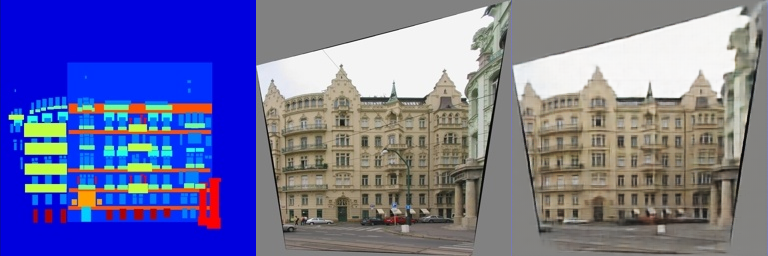
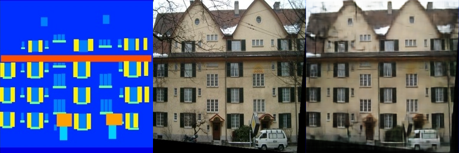

# Assignment 2 - DIP with PyTorch

# Implementation of deep learning-based DIP (Pix2Pix) with pytorch

This repository is Yuanhao Li's implementation of Assignment_02 of DIP.

## Running

To run Pix2Pix, run:
```bash
bash download_facades_dataset.sh
python train.py
```
to train the network.

The provided code will train the model on the [Facades Dataset](https://cmp.felk.cvut.cz/~tylecr1/facade/). You need to use [other datasets](https://github.com/phillipi/pix2pix#datasets) containing more images for better generalization on the validation set.

## Results

Training data:






Validation data:


## Acknowledgement

- [Assignment Slides](https://rec.ustc.edu.cn/share/705bfa50-6e53-11ef-b955-bb76c0fede49)
- [Paper: Image-to-Image Translation with Conditional Adversarial Nets](https://phillipi.github.io/pix2pix/)
- [Paper: Fully Convolutional Networks for Semantic Segmentation](https://arxiv.org/abs/1411.4038)
- [PyTorch Installation & Docs](https://pytorch.org/)
