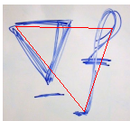

# Assignment 2 - DIP with PyTorch

# Implementation of traditional DIP (Poisson Image Editing)

This repository is Yuanhao Li's implementation of Assignment_02 of DIP.

## Running

To run Poisson image editing, run `python run_blending_gradio.py`, then use the interactive window.

## Results

Blended result:

## Acknowledgement

- [Assignment Slides](https://rec.ustc.edu.cn/share/705bfa50-6e53-11ef-b955-bb76c0fede49)  
- [Paper: Poisson Image Editing](https://www.cs.jhu.edu/~misha/Fall07/Papers/Perez03.pdf)
- [PyTorch Installation & Docs](https://pytorch.org/)
