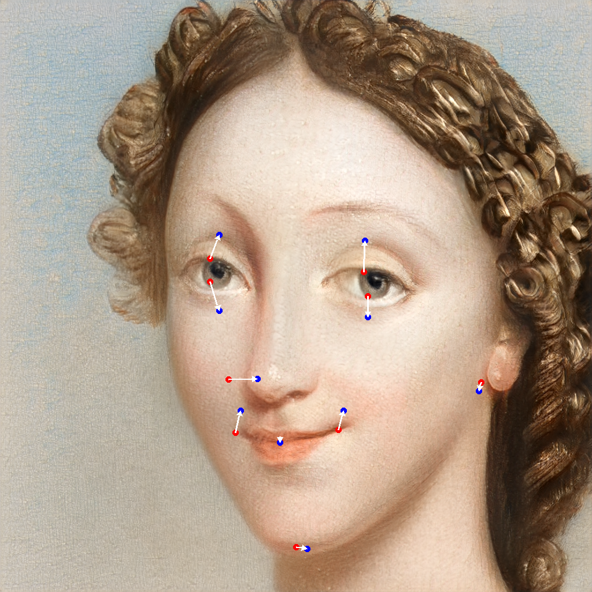

# Assignment 3 - Play with GANs

# Implementation of deep learning-based DIP (DragFace) with pytorch

This repository is Yuanhao Li's implementation of Assignment_03 of DIP.

### Requirements:
Install [DragGAN](https://github.com/OpenGVLab/DragGAN) and [face-alignment](https://github.com/1adrianb/face-alignment) to your python environment, then run `python main.py` to open the web page.

First select a model to produce an image containing only one human face, then adjust `Smile`, `Thinner face` or `Bigger eye` to a suitable value, then click `Auto edit` to edit human face.

# Results

<video src="video_b7ce60e5-ab15-461a-871d-979186bf2724.mp4" alt="Result video" controls>Result video</video>

---

# Acknowledgement

- [DragGAN](https://vcai.mpi-inf.mpg.de/projects/DragGAN/): [Implementaion 1](https://github.com/XingangPan/DragGAN) & [Implementaion 2](https://github.com/OpenGVLab/DragGAN)
- [Facial Landmarks Detection](https://github.com/1adrianb/face-alignment)
- [作业03-Play_with_GANs.pptx](https://rec.ustc.edu.cn/share/705bfa50-6e53-11ef-b955-bb76c0fede49)
